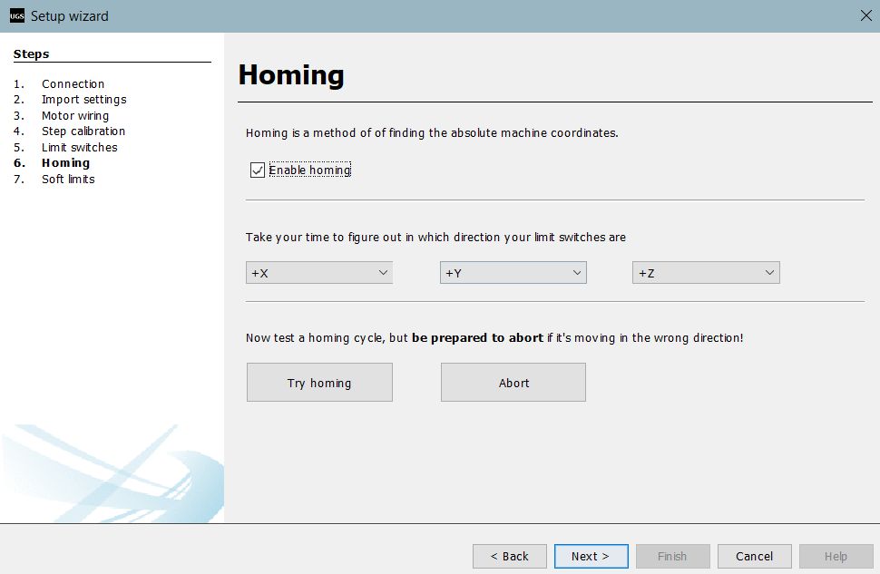

## Contents:
<ol>
   <li><a href="https://s-nithish-kumar.github.io/Development_of_a_Unique_Design_CNC_Sketching_Machine/#1-problem-statement">Problem Statement</a></li>
   <li><a href="https://s-nithish-kumar.github.io/Development_of_a_Unique_Design_CNC_Sketching_Machine/#2-objectives">Objectives</a></li>
   <li><a href="https://s-nithish-kumar.github.io/Development_of_a_Unique_Design_CNC_Sketching_Machine/#3-impact-of-solving-the-problem">Impact of Solving the Problem</a></li>
   <li><a href="https://s-nithish-kumar.github.io/Development_of_a_Unique_Design_CNC_Sketching_Machine/#4-proposed-design">Proposed Approach</a></li>
   <li><a href="https://s-nithish-kumar.github.io/Development_of_a_Unique_Design_CNC_Sketching_Machine/#5-technical-specifications">Technical specifications</a></li>
   <li><a href="https://s-nithish-kumar.github.io/Development_of_a_Unique_Design_CNC_Sketching_Machine/#6-final-setup">Implementation</a>
      <ul>
           <li><a href="https://s-nithish-kumar.github.io/Development_of_a_Unique_Design_CNC_Sketching_Machine/#hardware-assembly">Hardware Assembly</a></li>
           <li><a href="https://s-nithish-kumar.github.io/Development_of_a_Unique_Design_CNC_Sketching_Machine/#software-integration">Software Integration</a></li>
      </ul>
   </li>
   <li><a href="https://s-nithish-kumar.github.io/Development_of_a_Unique_Design_CNC_Sketching_Machine/#7-implementation">Final Setup</a></li>
   <li><a href="https://s-nithish-kumar.github.io/Development_of_a_Unique_Design_CNC_Sketching_Machine/#output">Output</a></li>
   <li><a href="https://s-nithish-kumar.github.io/Development_of_a_Unique_Design_CNC_Sketching_Machine/#results">Results</a></li>
   <li><a href="https://s-nithish-kumar.github.io/Development_of_a_Unique_Design_CNC_Sketching_Machine/#problems-and-troubleshooting">Problems and Troubleshooting</a></li>
   <li><a href="https://s-nithish-kumar.github.io/Development_of_a_Unique_Design_CNC_Sketching_Machine/#11-references">References</a></li>
</ol>

### 1. Problem Statement:
- Commercially available Sketching Machines have smaller work areas, which makes them unsuitable for applications such as poster making.
- Sketching Machines that have a larger work area use two motors for movement along the x-axis, which increases the power consumption and the cost of the machine.

### 2. Objectives:
- To come up with a unique design for a Sketching Machine to replace the need for two motors with a single motor to reduce the power consumption.
- To develop a CNC Sketching Machine with less wear and tear and easy serviceability.
- Ensure the machine has reasonable  accuracy and cycle time.

### 3. Impact of Solving the Problem:
- This project can fill the gap between power consumption and the work area.
- Provides flexibility for other applications such as CNC milling and laser cutting, where the sketch can be replaced with appropriate tools.

### 4. Proposed Design:
Modeling has been done using Fusion 360 software. Figure 1 shows the Isometric view of the 3D design of the machine. The design is simple and ergonomic, so in the event of the failure of any component, the component could be easily replaced since most of the components have temporary joints. The outer structure and the bearings are joined for better robustness.

2D sketches are generated from the 3D model using Fusion 360 software

### 5. Technical Specifications:
Tables 1 and 2 consist of the mechanical and electronic components used in the project, along with the specifications of each component.

### 6. Implementation:
#### Hardware assembly:
***Step 1:*** Creating outer body

***Step 2:*** Fixing bearings

***Step 3:*** Boring holes

***Step 4:*** Adding support structures

***Step 5:*** Assembly of axis of feed drive system

#### Software Integration:

Figure 3 Overall working flowchart

Figure 4 shows the flowchart of the entire process. First, the sketch will be converted to G-codes using CAM software. Once the G-codes are ready, the codes will be transmitted to the Microcontroller using interfacing software. The Microcontroller will convert the G-codes to electrical pulses using the GRBL firmware. The Motor driver will provide the required pulses to the motor for it to rotate. The synchronous movement of the motors produces a 2D sketch on the paper.

##### A. CAM Software:
F-engrave CAM software is used, which converts text and images into G-codes. Images in the DXF format can be imported into the software for conversion. Parameters such as height, width, thickness, z-safe, plunge rate, and feed rate can be provided in the software. Once the parameters are given, the image can be converted to G-codes.

##### B. Microcontroller Interfacing Software:
The Universal G-code Sender (UGS) is an interface software that interfaces G-codes with the microcontroller. The G-code generated from the F-engrave software needs to be imported into the UGS software. Certain parameters of the lead screw, like linear movement per 125 pulses, need to be entered into the software. The software can automatically calibrate according to the entered value. Even soft limits can be set using the software. Once all these steps are done, using Jog mode, all the axes of the machine will be set to their proper positions. Then the program can be started.

##### C. Firmware:
GRBL is a Firmware that is uploaded to the Arduino Microcontroller. UGS sends the G-code to the Arduino. GRBL will help to convert each line of G-code into electrical pulses and send those pulses to the CNC shield, which then controls the Stepper motors so that the desired motion can be achieved.

##### D. Input:
The image below shows the F-Engrave window. The required text can be entered in the Input text box. Text Font properties and G-code properties can be changed as per the requirement. Once everything is done, click on File and Save as G-code.

The picture below shows the F-Engrave window. For images to be imported into F-Engrave, the format must be .dxf. So, the images must be converted into .dxf format before importing them into F-engrave. Image properties and G-code properties can be given as per the requirement, and G-code can be saved.

##### E. G-code Conversion:
There are seven steps to be followed for setting up the UGS

***1) Connection:*** Connection must be established between the controller and the computer.

***2) Import settings:*** Any setting saved previously can be imported.

***3) Motor wiring:*** If the motor is connected in the reverse direction, the direction could be changed in the software.

***4) Step calibration:*** This is a very important step. Since the pitch of the lead screw varies, step calibration must be done to achieve the desired linear displacement.

***5) Limit Switches:*** Hard limit switches can be enabled if required.

***6) Homing:*** Homing is a method of finding absolute machine coordinates. But hard limit switches are mandatory for homing.

***7) Soft limits:*** Soft limits switches can also be set if required. But Homing needs to be enabled before enabling soft limits.

Various states like Units, Distance Mode, Work Offset, Active Plane which should be checked before starting the machine.

Once these steps are completed, G-code can be imported into the UGS. To import G-code, click on File and Open.

Once the G-code has been imported, the initial position can be set using jog mode. After setting the initial position, the play button can be pressed to start the sketching. Figure 8 shows the UGS Window after all the initials have been entered.

### 7. Final Setup:
The picture below is the final setup. The yellow bounding box is the location where the tools can be mounted. For sketching, a sketch will be mounted here.

### 8. Output:
The pictures below are the sketches drawn using the machine.

### 9. Results:
Table 3 shows the cycle time for drawing each picture. As the size of the picture increases, the cycle time will also increase accordingly. The waviness in the picture is due to the bend in the y-axis lead screw and could be considerably eliminated by replacing the lead screw with a proper one. The cycle time is high because rapid traverse could not be achieved as the torque required is high. The cycle time can be reduced by upgrading the motor, if required.

Table 4 shows the comparison of work area, power consumption, and cost between the existing products and this product. Clearly, the work area of the existing products is small compared to our machine. Despite the work area being small, the price of these products is also high, and as the work area increases, the price of the product shoots up. Though in this research work the work area has been increased, power consumption has also been managed to some extent.

### 10. Problems and Troubleshooting:
- Though Light Gauge Steel is used for fabrication, the weight of the machine increased considerably more than expected. The converted g-code from the F-engrave software has the g-code command for rapid traverse. Due to the added weight and limited torque of the x-axis motor, rapid traverse is not possible, and the motor doesn’t spin when a rapid traverse command is provided. To overcome this problem, all the rapid traverse g-code commands have been converted to feed rate traverse g-code commands (G00 to G01) using a text editor.
+ The rods and leads were not smooth enough to traverse the ball bearings and screws and are smoothed by rubbing over the surface using emery sheets.

### 11. References:
1. Pradip Patil, Prithviraj Lidhade, Sushant Khamkhar, Yashodip Mane, Akshay Dhole, Suraj Patil, “Design and development of CNC plotter machine”, International Research Journal of Modernization in Engineering Technology and Science,Volume:02/Issue:09/September -2020.
2. Sriranga V Deshpande, P U Karthik, Naveen Kumar D, Dr Vijendra Kumar, Dr K. S Badrinaryan, “Design and fabrication of 3-axis CNC Milling machine”, International Journal of Engineering Research and General Science,Volume 6, Issue 4, July-August, 2018.
3. Md. Mahedi Hasan, Md. Rokonuzzaman Khan, Abu Tayab Noman, Humayun Rashid, Nawsher Ahmed, Nawsher Ahmed, “Design and Implementation of a Microcontroller Based Low-Cost Computer Numerical Control (CNC) Plotter using Motor Driver Controller”, International Conference on Electrical, Computer and Communication Engineering (ECCE), 7-9 February, 2019.
4. Mr. Prashil N Patel, Mr. Shreyas D Pavagadhi, Dr.Shailee G Acharya, “Design and Development of Portable 3-Axis CNC Router Machine”, International Research Journal of Engineering and Technology, volume: 06, Issue: 03, Mar 2019.
5. https://howtomechatronics.com/tutorials/how-to-setup-grbl-control-cnc-machine-with-arduino/

